# AI Dashcam (Raspberry Pi Production)

Local-first AI dashcam designed for **Raspberry Pi deployment**.  

# AI Dashcam Engine
> A High-Performance, Multithreaded Edge Vision Platform for the Raspberry Pi 5

Welcome to the **AI Dashcam Engine** repository. This platform turns an everyday Raspberry Pi 5 and an IMX219 lens module into a real-time, edge-computing intelligent traffic tracking assistant. 

Designed entirely around modular, object-oriented, and thread-safe Python principles, this engine splits camera execution, local neural network processing, and network broadcasting into isolated concurrent tasks. This completely eliminates UI stuttering, keeping the camera capture rolling at maximum frames-per-second even under heavy edge AI loads.

## How the system works! 

```mermaid
graph TD
    %% Shared State Container
    subgraph ServerState [Thread-Safe ServerState Memory]
        Lock[threading.Lock]
        FrameBuffer[Raw RGB888 Frame Matrix]
        AnnotatedBuffer[Annotated BGR Frame Buffer]
    end

    %% Isolated Threads
    Cam[1. Hardware Capture Thread] -->|Pulls 20+ FPS Raw Stream| FrameBuffer
    
    FrameBuffer -->|Zero-Overhead NumPy Copy| AI[2. Local Inference Thread]
    AI -->|YOLOv8 Nano Analysis & Filter| AnnotatedBuffer
    
    AnnotatedBuffer -->|Multipart Streaming Buffer| API[3. FastAPI Server Thread]
    API -->|Live MJPEG Broadcast| Driver[Driver's Browser Interface]

    %% Style Adjustments
    style ServerState fill:#1f1f1f,stroke:#00dbff,stroke-width:2px;
    style Lock fill:#ff3e3e,stroke:#fff;
```

## Deployment Scope

- **Production Target:** Raspberry Pi 4/5 + CSI/USB camera
- **Development Target:** macOS laptop (non-production simulation only)

## Features (Pi-Centric)

### Camera (Raspberry Pi)
- `PiCamera` is the primary production camera driver.
- Supports Raspberry Pi camera workflows (CSI / V4L2 / USB UVC).
- Configurable resolution and FPS tuned for Pi hardware limits.
- Monotonic frame pacing for real-time capture stability.
- In-memory pre-buffer (`deque`) for pre-incident video context.
- Telemetry HUD overlays rendered before writing/streaming.
- Controlled recording lifecycle with safe release on shutdown.

### Processing (Raspberry Pi)
- Local YOLO inference pipeline optimized for edge runtime.
- Threat analytics trigger incidents from inference metadata.
- Full frame metadata scan for `intrusion_alert` detection.
- Optical-flow speed estimation for motion-aware telemetry.
- Local-first processing with no required cloud dependency.

### Storage (Raspberry Pi)
- Continuous normal clips in `mock_dashcam_clips/`.
- Incident folders with timestamp format:
  - `incident_YYYYMMDD_HHMMSS_mmm`
- Incident assets:
  - `snapshot_<timestamp>.jpg`
  - `clip_<timestamp>.avi`
- Pre-buffer flush into incident clip at trigger time.
- Async retention policy enforcement for non-blocking cleanup.
- Active-file protection to avoid deleting in-progress clips.

## Pi Hardware Requirements

- Raspberry Pi 5 (recommended) or Pi 4 (4GB+ minimum)
- Camera Module v2/v3 or USB UVC webcam
- 32GB+ microSD (64GB+ recommended) or external USB SSD
- Official power supply (Pi 5: 27W USB-C recommended)
- Passive heatsink minimum; active cooling recommended

## Pi Runtime Requirements

- Raspberry Pi OS (64-bit recommended)
- Python 3.14
- OpenCV, NumPy, Ultralytics, reverse-geocoder
- Writable local storage path for clips and incidents

## macOS Development Note

macOS support is for:
- local testing
- pipeline validation
- UI/preview debugging

It is **not the production deployment target**.

## Project Structure

- `src/main.py` — orchestration and lifecycle state machine
- `src/camera/base_camera.py` — camera contract
- `src/camera/pi_camera.py` — Pi production camera driver
- `src/camera/mac_camera.py` — macOS development camera driver
- `src/processing/analytics.py` — threat analytics
- `src/storage/circular_buffer.py` — retention management
- `docs/` — architecture and hardware/software documentation

## Pi-First Roadmap

### Camera
- CSI camera auto-reconnect and fault recovery
- Hardware encode acceleration profile for Pi
- Camera calibration presets (mount angle/FOV)

### Processing
- Pi-tuned inference backends (ONNX/TensorRT where applicable)
- Event severity scoring and reduced false positives
- Runtime telemetry/performance counters

### Storage
- Incident metadata sidecar (`.json`) per event
- Separate retention tiers for normal vs incident media
- Integrity marker on finalized incident clips

## Future Pi Features

### Camera
- Dual-camera support (front/rear)
- Low-light/night driving profile
- Privacy masking regions

### Processing
- Multi-object tracking IDs
- Lane/near-miss behavioral analysis
- Edge acceleration integrations

### Storage
- Encrypted incident export bundles
- Immutable incident lock mode
- Background clip compaction/transcoding
